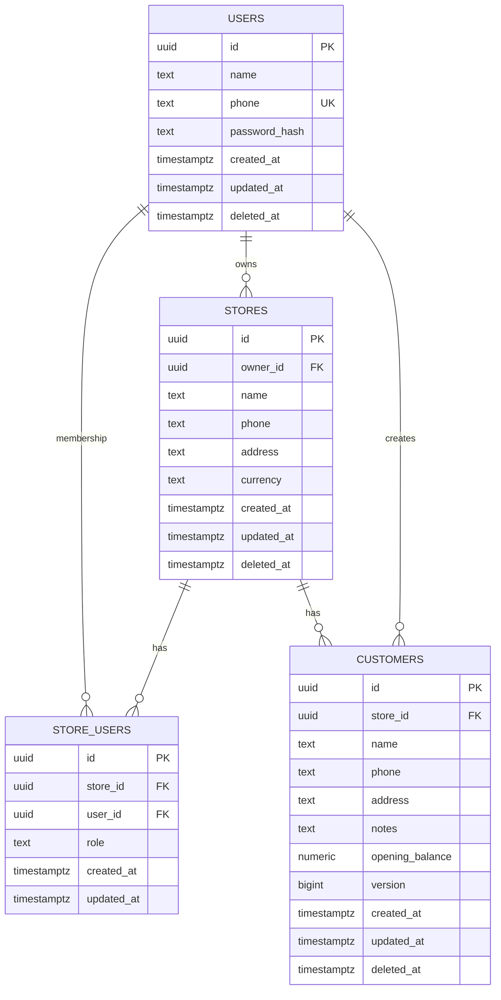

# دَكانة — ERD

## Phase 1 core

## Full MVP relationship map

- `stores.owner_id -> users.id`
- `store_users.store_id -> stores.id`
- `store_users.user_id -> users.id`
- Every business table contains `store_id` for tenant isolation.
- Customers and suppliers keep opening balances as starting values; subsequent financial movement is represented by immutable transaction rows.
- Sales own sale items; purchases own purchase items.
- Inventory movement references its source operation.
- Cash movement references its source operation.
- Sync and audit records identify the store, user, and device.

## Invariants

1. A user may access data only through an active `store_users` membership.
2. Financial records are never physically deleted after posting.
3. `client_transaction_id` is unique per store for idempotent writes.
4. Historical sale cost is stored on `sale_items.cost_price`.
5. Metadata entities use versioning for conflict detection.
